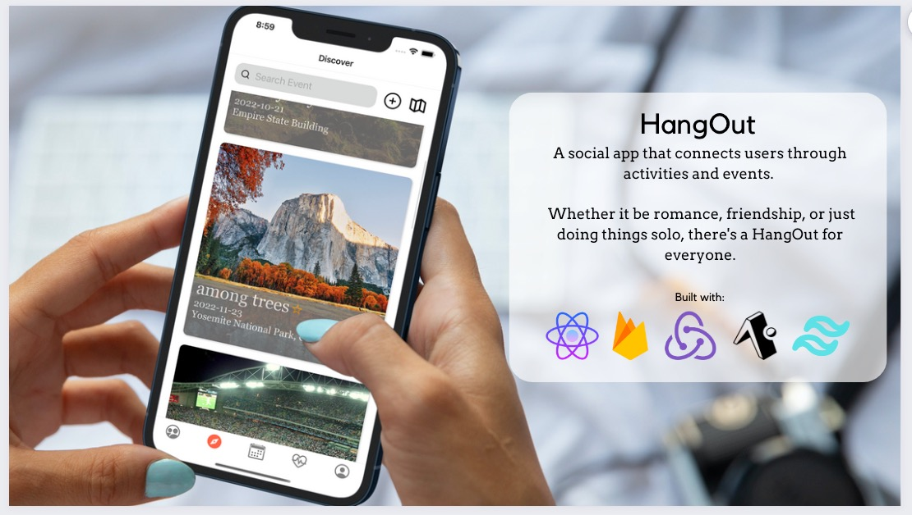
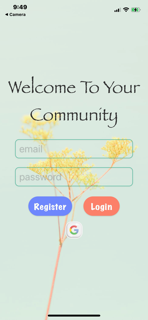
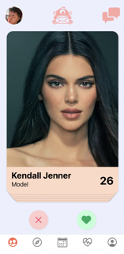
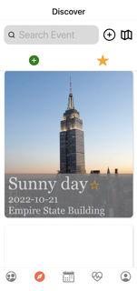
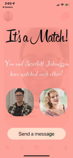
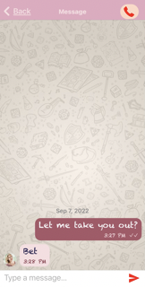

<h1 align="center">
  $${\color{lightblue}HangOut}$$
</h1>

  <kbd>
    
  </kbd>
  
  

    <h3>Live demo</h3>
    <a href="https://www.youtube.com/watch?v=SVDFDJWC3bA&list=PLx0iOsdUOUmnLN8sDLqSgVBNZmFq7Rx4k&index=8" target="_blank">
      <kbd></kbd>
    </a>
  

#### A social app that connects users by centering community connection through events and activities that are close to both users. Users can choose how they want to use the app *<kbd>romance</kbd>, <kbd>friendship</kbd>, <kbd>solo</kbd>*.

#### <h3>Built with:</h3> React Native/Expo cli, Firebase NoSQL (Firestore, Auth, Storage) and a variety of **APIs** (*react-native-deck-swiper, react-native-gifted-chat, expo-image-picker, react-native-maps, react-native-google-places-autocomplete, datetimepicker*). 

#### Using the knowledge and foundation we gained from the bootcamp to build a fullstack React web app, we were able to quickly adapt and navigate new documentation that allowed us to build a fullstack iOS React-Native mobile app. During the process of this project, we practiced clear and consistent communication within a remote setting across different time zones. By doing so, we successfully created a positive and supportive work environment 😊. 

<h2 align="center">
  Creators:
</h2>

  <kbd>
    
  </kbd>

<h2 align="center">
  <pre>
    Donna Sayos <a href="https://www.linkedin.com/in/dsayos/"><kbd></kbd></a>
  </pre>
  <pre>
    Amy Ji <a href="https://www.linkedin.com/in/amy-ji-xueer/"><kbd></kbd></a>
  </pre>
  <pre>
    Dakota Fabro <a href="https://www.linkedin.com/in/dakotafabro/"><kbd></kbd></a>
  </pre>
</h2>

### Features:

  <table>
    <tr>
      <td>
        <h3 align="center">
          $${\color{lightgreen}Register \space / \space Login}$$
        </h3>
      </td>
      <td>
        <h3 align="center">
          $${\color{lightgreen}Swipe \space through \space users}$$
        </h3>
      </td>
      <td>
        <h3 align="center">
          $${\color{lightgreen}Add \space events \space / \space scroll \space through}$$
          $${\color{lightgreen}events \space / \space RSVP \space events}$$
        </h3>
      </td>
    </tr>
    <tr>
      <td align="center"><kbd></kbd></td>
      <td align="center"><kbd></kbd></td>
      <td align="center"><kbd></kbd></td>
    </tr>
   </table>

  <table>
    <tr>
      <td>
        <h3 align="center">
          $${\color{lightgreen}A \space match \space occurs \space if \space both \space users}$$
          $${\color{lightgreen}swipes \space right \space on \space each \space other}$$
        </h3>
      </td>
      <td>
        <h3 align="center">
          $${\color{lightgreen}Real-time \space chat!}$$
        </h3>
      </td>
    </tr>
    <tr>
      <td align="center"><kbd></kbd></td>
      <td align="center"><kbd></kbd></td>
    </tr>
   </table>

