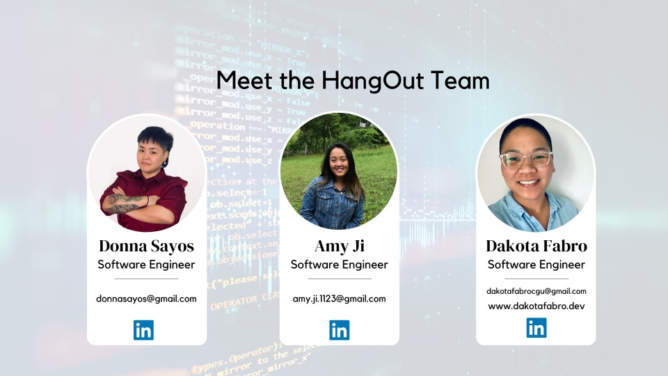

<h1 align="center">
  $${\color{lightblue}HangOut}$$
</h1>

  <kbd>
    
  </kbd>

#### A social app that connects users by centering community connection through events and activities that are close to both users. Users can choose how they want to use the app (*<kbd>romance</kbd>, friendship, solo*).

#### Built with $${\color{lightgreen}React \space Native \space Expo}$$ $${\color{red}Firebase \space (Firestore, \space Auth, \space Storage)}$$ and a variety of **APIs** (*react-native-deck-swiper, react-native-gifted-chat, expo-image-picker, react-native-maps, react-native-google-places-autocomplete, datetimepicker*). 

#### Using the knowledge and foundation we gained from the bootcamp to build a fullstack React web app, we were able to quickly adapt and navigate new documentation that allowed us to build a fullstack iOS React-Native mobile app. During the process of this project, we practiced clear and consistent communication within a remote setting across different time zones. By doing so, we successfully created a positive and supportive work environment 😊. 

### Creators:

  <kbd>
    
  </kbd>

<h2 align="center">
  <pre>
    Donna Sayos <a href="https://www.linkedin.com/in/dsayos/"><kbd></kbd></a>
  </pre>
  <pre>
    Amy Ji <a href="https://www.linkedin.com/in/amy-ji-xueer/"><kbd></kbd></a>
  </pre>
  <pre>
    Dakota Fabro <a href="https://www.linkedin.com/in/dakotafabro/"><kbd></kbd></a>
  </pre>
</h2>
